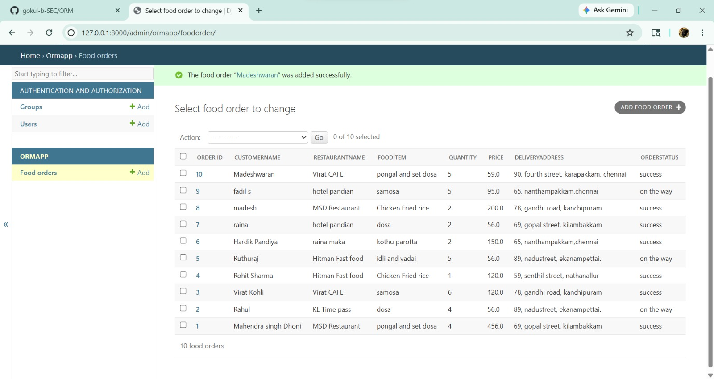

# Ex01 Django ORM Web Application
## Date: 20/05/2026

## AIM
To develop a Django application to manage an online food delivery platform like Zomato/Swiggy using Object Relational Mapping (ORM).

## ENTITY RELATIONSHIP DIAGRAM


## DESIGN STEPS

### STEP 1:
Clone the problem from GitHub

### STEP 2:
Create a new app in Django project

### STEP 3:
Enter the code for admin.py and models.py

### STEP 4:
Execute Django admin and create details for 10 books

## PROGRAM
models.py
```
from django.db import models

class FoodOrder(models.Model):
    Order_ID = models.IntegerField(primary_key=True)
    CustomerName = models.CharField(max_length=50)
    RestaurantName = models.CharField(max_length=50)
    FoodItem = models.CharField(max_length=100)
    Quantity = models.IntegerField()
    Price = models.FloatField()
    DeliveryAddress = models.CharField(max_length=200)
    OrderStatus = models.CharField(max_length=30)

    def __str__(self):
        return self.CustomerName
```

admin.py

```
from django.contrib import admin
from .models import FoodOrder

class FoodOrderAdmin(admin.ModelAdmin):
    list_display = (
        'Order_ID',
        'CustomerName',
        'RestaurantName',
        'FoodItem',
        'Quantity',
        'Price',
        'DeliveryAddress',
        'OrderStatus'
    )

admin.site.register(FoodOrder, FoodOrderAdmin)

```

## OUTPUT



## RESULT
Thus the program for creating a database using ORM hass been executed successfully
